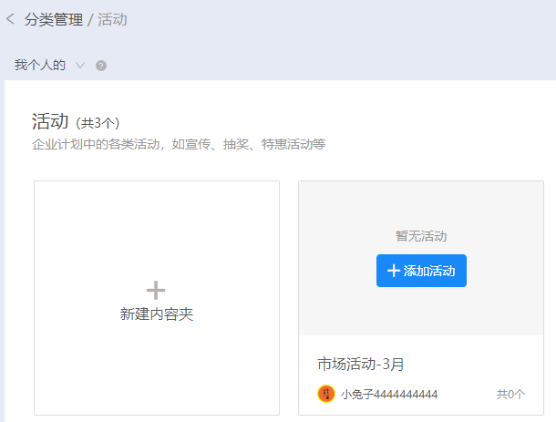

# 分类管理

1. 未开通全员营销小程序， 则用于根据营销内容的使用用途去做分类管理；

2. 开通全员营销小程序、内容营销小程序， 支持同步在全员营销公文包里做内容展示、分享、获客；分类内容包括企业介绍、活动、产品、资讯。

### 1. 添加企业介绍：

#### 输入内容夹名称

添加企业介绍  上传文件（支持pdf、png、jpg、jpeg格式）微信图文 营销内容中的作品

### 2. 添加活动

#### 输入内容夹名称

添加活动  上传文件（支持pdf、png、jpg、jpeg格式）微信图文 营销内容中的作品

### 3. 添加产品

#### 输入内容夹名称

#### 选择作品

### 4. 添加资讯

#### 输入内容夹名称

添加资讯  上传文件（支持pdf、png、jpg、jpeg格式）微信图文 营销内容中的作品

### 移动端展示：

