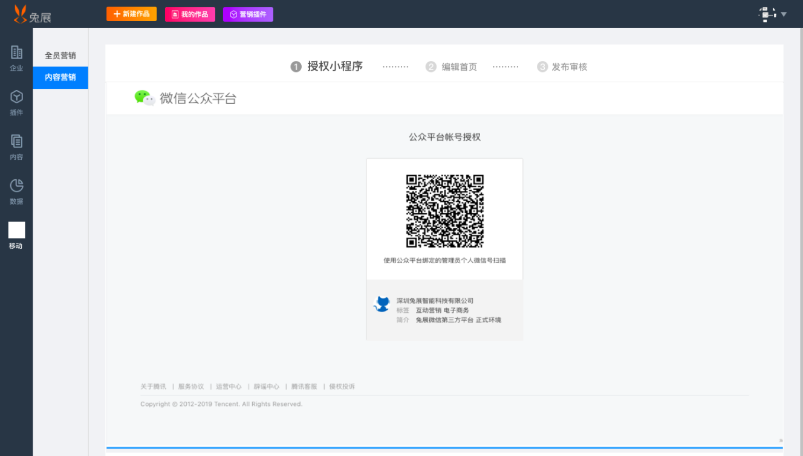

# 小程序申请及授权流程

### 开通准备

### 开通流程

登录微信公众平台——创建激活小程序——绑定小程序至客户自行创建且为授权公众号绑定的微信开放平台（若绑定至兔展创建的开放平台可跳过该步骤）——工作台扫码授权小程序

### 具体操作

1、登录微信公众平台（登录账号需与工作台绑定的公众号主体一致） 登录入口：微信公众平台[https://mp.weixin.qq.com/](https://mp.weixin.qq.com/)

2、创建小程序（内容营销小程序和全员营销小程序需分别创建两个小程序）

1\) 小程序管理—添加—选择快速注册并认证小程序

2\) 复用资质 

勾选运营者信息（勾选后小程序管理员即为公众号管理员，后续可跳过绑定小程序管理员步骤；不勾选，后续需进行小程序管理员绑定【步骤3】）— 勾选微信认证资质（不勾选无法复用企业主体资质，后续需花费300元进行微信认证）— 公众平台管理员扫码认证

3\) 填写小程序账号信息

a.该账号信息用于登录小程序后台（登录入口：微信公众平台[https://mp.weixin.qq.com/）](https://mp.weixin.qq.com/）)

b.写邮箱用于接收小程序激活邮件（一个邮箱只能注册一个小程序）

3、激活小程序 

1）点击收到邮件链接进行激活

2）绑定小程序管理员（小程序管理员和公众平台管理员可以不同）

3）填写小程序基本信息

 微信小程序后台首页—填写小程序名称、服务类别等信息（服务类目需选择工具—效率/企业管理）

4、绑定公众号和小程序至客户自行创建的微信开放平台（若绑定兔展创建的微信开放平台跳过该步骤） 

1）绑定公众号： 登陆微信开放平台（[https://open.weixin.qq.com/](https://open.weixin.qq.com/)）—管理中心—公众账号—绑定公众号

2）填写公众号的账号密码，点击下一步

3）公众号管理员扫二维码

绑定小程序：

 1）登陆微信开放平台（[https://open.weixin.qq.com/](https://open.weixin.qq.com/)）—管理中心—小程序—绑定小程序

2）填写小程序的账号密码，点击下一步

3）小程序管理员扫二维码

5.工作台授权小程序（全员营销小程序和内容营销小程序授权流程相同）

 1）小程序管理员扫码授权—选择授权的小程序及授权权限

6、发布审核小程序（审核时间一般为几小时至7个工作日）

7、小程序审核发布成功

