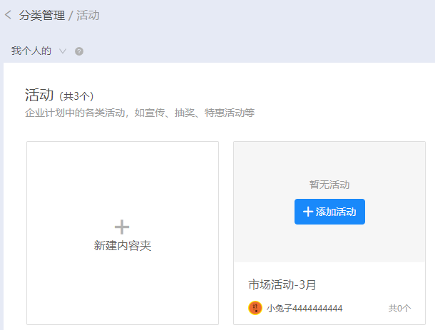

# 非关联企业微信

## 功能入口


登录兔展工作台后，点击 【企业】 -&gt; 【组织架构】进入

## 部门管理

### 新增部门


点击部门列表中的选项按钮，在下拉弹出框里选择【新增部门】


在弹出框中，输入部门名称，通过下拉框选择相应的上级部门。


填写完成后，点击【确认】按钮，即创建部门成功。

### 
编辑部门

点击部门列表中的选项按钮，在下拉弹出框里选择【编辑部门】

在弹出框中，修改部门名称，通过下拉框修改上级部门。


修改完成后，点击【确认】按钮，即编辑部门成功。

### 
删除部门

点击部门列表中的选项按钮，在下拉弹出框里选择【编辑部门】


在弹出的确认框中，点击【确认】，则删除成功，


删除前，需要将该部门下的子部门和员工删除完了才可进行删除，否则无法删除。

## 员工管理 

### 添加员工 

在【组织架构】页面中，点击页面“新增”按钮添加员工

在弹出框中，填写员工的基本信息。

选择归属部门，通过下拉进行选择。

非普通员工角色的员工可以选择负责部门，设置负责部门后，允许员工看该部门及其子部门的所有数据。包括部门下员工的任务分发获得的访问数据统计情况、该部门下员工创建的作品、该部门下员工带来的客户详细信息。

组织架构功能默认有5个角色，通过下拉选择该员工相应的角色。 各个角色的主要区别：

| **角色**  | **角色说明**  |
| :--- | :--- |
| 企业超管  | 有整个系统的所有功能权限，可管理组织架构里所有员工和作品数据。  |
| 业务管理员  | 有整个系统绝大多数功能权限。可查看，但无法创建客户档案里的客户分组，无法设置素材中小程序素材和企业的动态参数，可管理的员工和数据仅限已设置负责部门，超出负责部门数据无法管理。  |
| 渠道管理员  | 有整个系统绝大多数功能权限。可查看，但无法创建客户档案里的客户分组，无法设置素材中小程序素材和企业的动态参数、企业微信、公众号、权限设置，无法分发内容给员工渠道，可管理的员工和数据仅限已设置负责部门，超出负责部门数据无法管理。  |
| 策划员  | 有整个系统绝大多数功能权限。可查看，但无法创建客户档案里的客户分组，无法设置素材中小程序素材和企业的动态参数、企业微信、公众号、权限设置，可分发内容给负责范围内的员工渠道，可管理的员工和数据仅限已设置负责部门，超出负责部门数据无法管理。企业子账号默认为此角色。  |
| 普通员工  | 无法登录兔展官网 |

若以上默认角色不满足企业权限，可自定义角色并分配其对应的权限，可具体到某个板块的权限设置。

关联兔展选择是后，即允许该员工登录兔展官网，关联前，需要员工提前用手机号注册好兔展官网账号。 注意：关联的账号需要与该员工手机号一致。

关联成功后，员工通过手机号登录兔展官网，可以看到兔展的企业身份

添加员工成功后，该员工显示在列表中，状态为“未激活”状态

### 编辑员工

在【组织架构】页面中，选择某个员工，点击“编辑”按钮，进入该员工编辑。

弹出“编辑员工”的弹出框。已绑定验证微信的用户，无法修改手机号。
关闭该员工关联兔展时，需将先将该员工的手机号取消关联。取消关联后，该员工登录兔展官网，无法选择企业身份。

点击，“解绑微信”按钮，在确认解绑后，该员工关联的微信信息将被清空，也将无法给该员工下发消息。

### 批量导入员工

在员工列表里顶部，点击“批量导入”按钮。

在弹出框中，点击“下载模板”下载导入的模板。

根据导入规则，编写员工相关信息。填写归属部门时，需要与现在组织架构的部门保持一致。

编辑好相应的员工信息后，选择相应的文件进行导入。

如果上传文件不符合规范，则无法导入，跟进提示进行修改重新上传。

### 修改员工状态

在员工列表中，选择“未激活”状态的员工，在操作按钮中 点击“激活”按钮

弹出员工加入组织架构的微信参数二维码，让员工扫码关注后并验证绑定到微信公众号

在员工列表中，选择“已激活”状态的员工，在操作按钮中 点击“停用”按钮

在弹出框中，点击“确认”按钮后，停用员工成功。

 在员工列表中，选择“已停用”状态的员工，在操作按钮中 点击“启用”按钮

在弹出框中，点击“确认”按钮后，停用员工成功。

在员工列表中，选择某一个员工，在操作按钮中 点击“删除”按钮

在弹出框中，点击“确认”按钮后，该员工被删除，删除后，该员工无法使用组织架构功能，无法成为组织架构的员工，无法对该员工进行推送。

### 批量操作员工

在员工列表中，批量选择员工，则对选中的员工进行停用，启用和删除操作。

### 搜索和筛选员工

在员工列表的上方，输入员工的姓名或手机号进行搜索

点击“更多筛选”按钮，根据员工更多的信息进行搜索。

